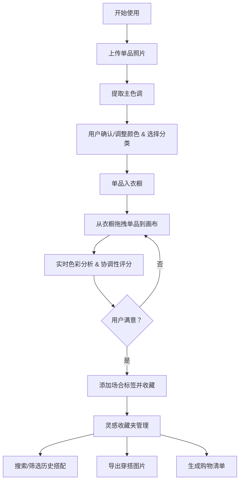

## 1. 产品概述

"个人色彩搭配方案与穿搭灵感收藏器"是一款面向时尚爱好者的纯前端工具，帮助用户管理衣橱单品、探索色彩搭配方案、并收藏穿搭灵感。通过上传单品照片自动提取主色调，基于色彩理论进行搭配分析，提供可视化的穿搭画布和灵感收藏功能。

- **目标用户**：注重个人形象管理的时尚爱好者、穿搭新手、造型师
- **核心价值**：降低穿搭决策成本，建立个人色彩体系，系统化管理穿搭灵感

## 2. 核心功能

### 2.1 用户角色
| 角色 | 注册方式 | 核心权限 |
|------|----------|----------|
| 普通用户 | 无需注册，本地使用 | 全部功能，数据存储于本地 localStorage |

### 2.2 功能模块
1. **单品衣橱**：照片上传、主色调提取、单品分类（上衣/下装/鞋子/配饰）、单品管理
2. **搭配画布**：拖拽单品到画布、自由布局、整体效果预览、色彩协调性实时评分
3. **风格筛选器**：按搭配风格（同色系/互补色/中性色）筛选、按场合标签筛选
4. **灵感收藏夹**：收藏搭配方案、标签管理、历史记录搜索
5. **导出与分享**：穿搭方案图片导出、购物清单生成

### 2.3 页面详情
| 页面名称 | 模块名称 | 功能描述 |
|----------|----------|----------|
| 主应用（单页） | 顶部导航栏 | Logo、功能切换标签、导出按钮 |
| | 单品衣橱区 | 分类标签、单品卡片网格、上传入口、搜索过滤 |
| | 搭配画布区 | 可拖拽画布、单品图层管理、色彩分析面板、协调性评分 |
| | 灵感收藏区 | 收藏卡片网格、场合标签筛选、搜索框 |
| | 色彩分析面板 | 主色调展示、搭配风格识别、协调性评分、色彩理论说明 |
| | 购物清单弹窗 | 缺漏单品建议、清单导出 |

## 3. 核心流程

用户上传单品照片 → 系统自动提取主色调并允许用户调整 → 用户选择单品分类 → 从衣橱拖拽单品到搭配画布 → 系统实时分析色彩搭配并给出评分 → 用户满意后添加场合标签并收藏 → 在灵感收藏夹中按标签/场合搜索历史搭配 → 导出穿搭图片或生成购物清单

## 4. 用户界面设计

### 4.1 设计风格

- **主色调**：奶油米白 `#F5F1EB` 作为背景，营造高级杂志感
- **强调色**：深勃艮第红 `#8B2635` 作为品牌色，鼠尾草绿 `#6B8E6B` 作为辅助色
- **文字色**：炭黑 `#1C1C1C` 为主文字，暖灰 `#6B6560` 为次要文字
- **按钮风格**：圆角矩形（圆角 8px），主按钮实色填充，次按钮描边
- **字体**：标题使用优雅衬线字体 "Playfair Display"，正文使用干净无衬线 "DM Sans"
- **布局风格**：非对称杂志式网格布局，大量留白，卡片式容器，柔和阴影
- **图标风格**：线性纤细图标，配合时尚感 emoji

### 4.2 页面设计概览
| 页面名称 | 模块名称 | UI 元素 |
|----------|----------|----------|
| 主应用 | 单品衣橱区 | 分类 Tab、卡片网格（单品缩略图+色卡+分类标签）、悬浮上传按钮、卡片拖拽时发光效果 |
| | 搭配画布区 | 虚线边框画布区域、可拖拽定位的单品图层、右下角浮动评分徽章、色卡展示条 |
| | 灵感收藏区 | 瀑布流收藏卡片、场合标签 chips、搜索框、卡片悬停放大效果 |
| | 色彩分析面板 | 圆形色卡、风格标签（同色系/互补色/中性色）、进度条式评分、理论说明文案 |
| | 顶部导航 | 衬线字体 Logo、功能切换 Tab、导出下拉菜单 |

### 4.3 响应式
采用桌面端优先设计，画布区域在平板端自适应缩小，移动端采用纵向堆叠布局，衣橱和画布上下分布。拖拽操作在触摸设备上采用长按触发。

### 4.4 动效与交互
- 单品卡片悬停：轻微上浮 + 柔和阴影加深
- 拖拽单品到画布：画布边框高亮、目标位置出现占位虚影
- 评分变化：数字滚动动画 + 进度条平滑过渡
- 收藏成功：卡片弹出心形粒子动画
- 页面加载：各模块错峰淡入（staggered reveal）
