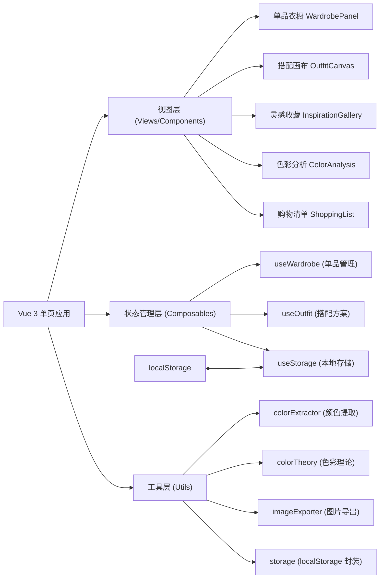
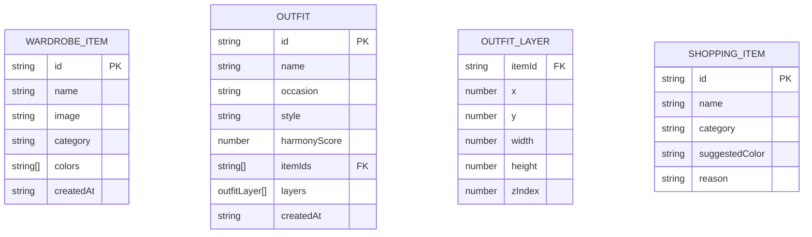

## 1. 架构设计



## 2. 技术说明

- **前端框架**：Vue 3 + TypeScript + Composition API
- **构建工具**：Vite 5
- **样式方案**：Tailwind CSS 3
- **路由**：Vue Router 4（单页应用，tab 切换）
- **状态管理**：Vue 3 Composables（轻量级，无需 Pinia）
- **本地存储**：localStorage（封装为响应式 hook）
- **图标库**：Lucide Vue Next
- **拖拽实现**：原生 HTML5 Drag & Drop API
- **图片处理**：Canvas API（颜色提取、图片导出）
- **初始化工具**：vite-init

## 3. 路由定义

| 路由 | 用途 |
|------|------|
| / | 主应用页面（包含所有功能模块的单页布局） |

## 4. 数据模型

### 4.1 数据模型定义



### 4.2 TypeScript 类型定义

```typescript
type Category = 'top' | 'bottom' | 'shoes' | 'accessory'
type StyleType = 'monochromatic' | 'complementary' | 'neutral' | 'analogous'
type Occasion = 'daily' | 'work' | 'date' | 'party' | 'travel' | 'sport'

interface WardrobeItem {
  id: string
  name: string
  image: string
  category: Category
  colors: string[]
  createdAt: string
}

interface OutfitLayer {
  itemId: string
  x: number
  y: number
  width: number
  height: number
  zIndex: number
}

interface Outfit {
  id: string
  name: string
  occasion: Occasion | ''
  style: StyleType | ''
  harmonyScore: number
  itemIds: string[]
  layers: OutfitLayer[]
  createdAt: string
}

interface ShoppingItem {
  id: string
  name: string
  category: Category
  suggestedColor: string
  reason: string
}
```

### 4.3 localStorage 数据结构

```typescript
interface AppStorage {
  wardrobe: WardrobeItem[]
  outfits: Outfit[]
}
```

## 5. 项目目录结构

```
src/
├── components/
│   ├── wardrobe/
│   │   ├── WardrobePanel.vue
│   │   ├── ItemCard.vue
│   │   ├── ItemUploader.vue
│   │   └── CategoryTabs.vue
│   ├── canvas/
│   │   ├── OutfitCanvas.vue
│   │   ├── CanvasItem.vue
│   │   └── HarmonyBadge.vue
│   ├── inspiration/
│   │   ├── InspirationGallery.vue
│   │   └── OutfitCard.vue
│   ├── analysis/
│   │   ├── ColorAnalysis.vue
│   │   └── ColorPalette.vue
│   ├── shopping/
│   │   └── ShoppingListModal.vue
│   └── common/
│       ├── TagChip.vue
│       └── ScoreProgress.vue
├── composables/
│   ├── useWardrobe.ts
│   ├── useOutfit.ts
│   ├── useStorage.ts
│   └── useDragDrop.ts
├── utils/
│   ├── colorExtractor.ts
│   ├── colorTheory.ts
│   ├── imageExporter.ts
│   └── storage.ts
├── types/
│   └── index.ts
├── App.vue
├── main.ts
└── style.css
```

## 6. 关键技术实现点

### 6.1 颜色提取算法
使用 Canvas API 读取图片像素数据，采用 K-Means 聚类算法提取 3-5 个主色调，转换为 HEX 格式。

### 6.2 色彩理论分析
- **同色系 (Monochromatic)**：色相相同，明度/饱和度不同
- **互补色 (Complementary)**：色环上相差 180°
- **邻近色 (Analogous)**：色环上相差 30°-60°
- **中性色 (Neutral)**：黑/白/灰/米/棕等低饱和度颜色

### 6.3 协调性评分
综合考虑色相距离、饱和度差异、明度对比度、冷暖平衡等因素，给出 0-100 分评分。

### 6.4 图片导出
使用 html2canvas 库（或原生 Canvas API）将画布区域渲染为 PNG 图片并触发下载。
